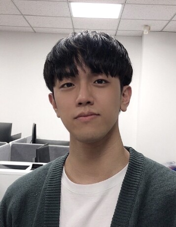
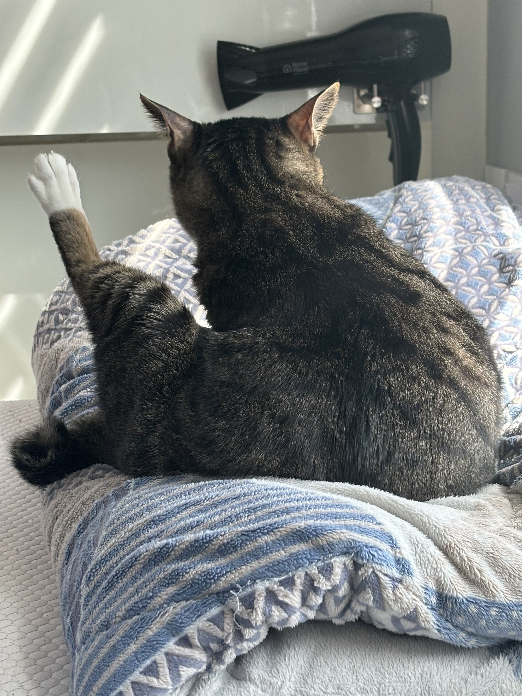

# 안태건 Taegun An 
 

## Introduction to Myself, **Taegun An**, Github page, May 2024
My current interest is more explainable and flexible neural architecture search (NAS) that can be applied to any type of task.
I'm keep studying various concepts and methods for it, and thinking their application to the NAS.

## Contacts
- email: antaegun20@korea.ac.kr
- google scholar: [Taegun An](https://scholar.google.com/citations?user=7-sQxgkAAAAJ&hl=en&oi=ao)
- linkedin: [Taegun An](https://www.linkedin.com/in/taegun-an-a41513286/)
- istg: [dante.gun](https://www.instagram.com/dante.gun/)
- blog: [curiositae](https://curiositae.tistory.com/)
- office: [RAINLAB](https://rain.korea.ac.kr)

## Education
- [2020 ~ now] Korea University (KU) \
Ph.D. Student (Integrated Course of MS & Ph.D), Computer Science & Engineering

- [2016 ~ 2020] Ulsan National Institute of Science and Technology (UNIST) \
Bachelor’s degree, Computer Science & Engineering

- University of Arts London (UAL) \
short-term exchange course

## Publications
- HCF: Hierarchical Cascade Framework for Distributed Multi-Stage Image Compression, Junhao Cai; **Taegun An**, Chengjun Jin, Sung Il Choi, Juhyun Park, and Changhee Joo*, AAAI 2026. (Oral)
- DAG-NAS: Explainable Neural Architecture Search for Reinforcement Learning via Scalar-level DAG Modeling; **Taegun An** and Changhee Joo*, Arxiv Preprint, Sep. 2024
- CycleGANAS: Differentiable Neural Architecture Search for CycleGAN; **Taegun An** and Changhee Joo*, CVPR-NAS Workshop, June 2024.

## Honors/Awards
- UNIST Cultural Exchange Scholarship, 2018
- Best Presentation Award, A3 Foresight Program, 2023

## Skills
- Used to C/C++, Python
- English: Upper-Intermediate / Korean: Native

## Activities
- UNIST Ensemble (Orchestra Club, Violin 🎻)
- KUFIT (Fitness Club, bodybuilding, 💪)

