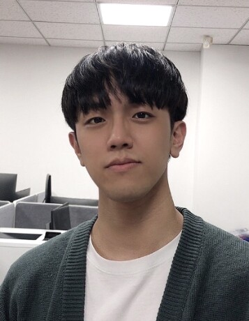
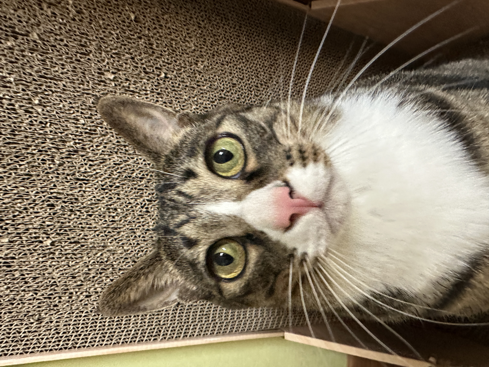
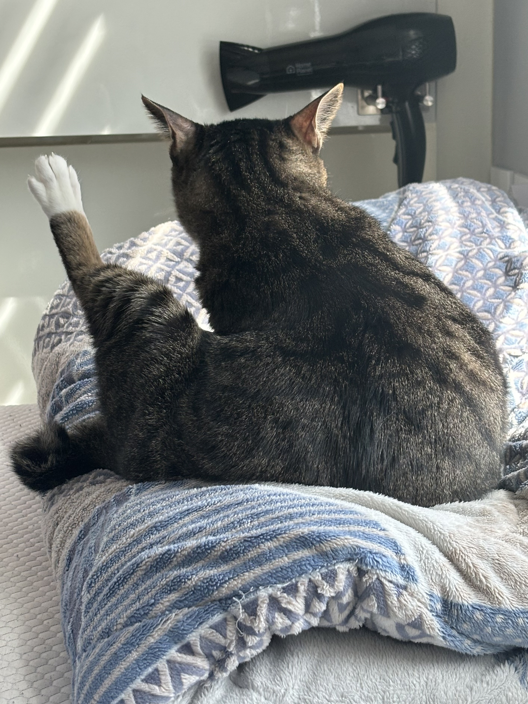
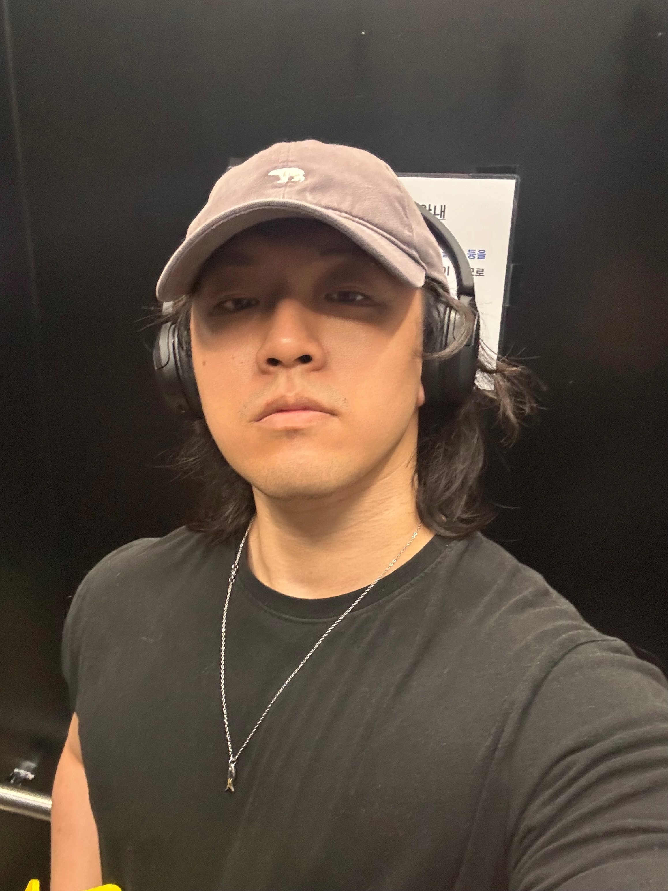

# 안태건 Taegun An 
    

## Introduction to Myself, **Taegun An**, Github page, May 2024
My research interests lie in efficient and explainable neural architecture design, including NAS, optimization, and parameter–performance trade-offs. I like asking how much performance we can squeeze out of an architecture—before simply throwing more parameters at it.

## Contacts
- email: antaegun20@korea.ac.kr
- google scholar: [Taegun An](https://scholar.google.com/citations?user=7-sQxgkAAAAJ&hl=en&oi=ao)
- linkedin: [Taegun An](https://www.linkedin.com/in/taegun-an-a41513286/)
- DBLP: [Taegun An](https://dblp.org/pid/325/0951.html)
- istg: [dante.gun](https://www.instagram.com/dante.gun/)
- blog: [curiositae](https://curiositae.tistory.com/)
- office: [RAINLAB](https://rain.korea.ac.kr)

## Education
- [2020 ~ now] Korea University (KU) \
Ph.D. Student (Integrated Course of MS & Ph.D), Computer Science & Engineering

- [2016 ~ 2020] Ulsan National Institute of Science and Technology (UNIST) \
Bachelor’s degree, Computer Science & Engineering

- [2018] University of Arts London (UAL) \
short-term exchange course

## Publications
- On the Depth Scalability of Logic Gate Networks; \
  **Taegun An**, Dohun kim, Haebeom Lee and Changhee Joo*, 2026
- DAG-NAS: Explainable Neural Architecture Search for Reinforcement Learning via Scalar-level DAG Modeling; \
  **Taegun An** and Changhee Joo*, Neural Networks, Feb. 2026
- HCF: Hierarchical Cascade Framework for Distributed Multi-Stage Image Compression \
  Junhao Cai; **Taegun An**, Chengjun Jin, Sung Il Choi, Juhyun Park, and Changhee Joo*, AAAI 2026. (Oral)
- CycleGANAS: Differentiable Neural Architecture Search for CycleGAN; \
  **Taegun An** and Changhee Joo*, CVPR-NAS Workshop, June 2024.

## Honors/Awards
- UNIST Cultural Exchange Scholarship, 2018
- Best Presentation Award, A3 Foresight Program, 2023
- Expert Research Personnel, 2023 ~ Current

## Skills
- Mostly Python, occasionally C/C++
- Korean: Native · English: Upper-Intermediate · Japanese: merely communicable

## Activities
- UNIST Sudam(手談) (Boardgame Club, Baduk Amateur 初段(1st Dan, Shodan) ⚫⚪)
- UNIST Ensemble (Orchestra Club, Violinist by hobby 🎻)
- KUFIT (Fitness Club, bodybuilding, 💪) \
  S:155kg B:95kg D:155kg Total: 405kg

